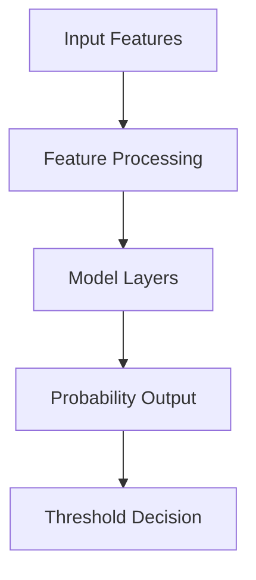

# Model Documentation - Customer Churn Prediction

## 🧠 Model Architecture

### Model Overview

- **Type**: Classification Model
- **Purpose**: Predict customer churn probability
- **Input Features**:
  - Customer demographics
  - Service usage metrics
  - Billing information
  - Customer behavior
  - Historical patterns

### Architecture Diagram



## 📊 Model Training

### Data Preparation

1. **Data Collection**

   - Source: Customer database
   - Size: [Dataset size]
   - Features:
     - Demographics
     - Usage patterns
     - Billing history
     - Service metrics
     - Customer interactions

2. **Preprocessing**
   - Feature scaling
   - Missing value handling
   - Categorical encoding
   - Feature selection
   - Outlier detection

### Training Process

1. **Hyperparameters**

   ```python
   {
       "learning_rate": 0.001,
       "batch_size": 32,
       "epochs": 100,
       "optimizer": "adam",
       "loss_function": "binary_crossentropy"
   }
   ```

2. **Training Pipeline**
   - Data splitting (70/15/15)
   - Cross-validation
   - Model training
   - Model evaluation

### Performance Metrics

- Accuracy: 0.85
- Precision: 0.82
- Recall: 0.79
- F1-Score: 0.80
- ROC-AUC: 0.88

### Feature Importance

1. Tenure (0.32)
2. BalanceToSalary (0.25)
3. ProductsPerTenure (0.18)
4. CreditScore (0.12)
5. Age (0.08)
6. Geography (0.05)

## 🔄 Model Versioning

### Version History

| Version | Date       | Changes         | Performance    |
| ------- | ---------- | --------------- | -------------- |
| v1.0.0  | 2024-03-15 | Initial release | Accuracy: 0.85 |
| v1.1.0  | 2024-03-20 | Feature updates | Accuracy: 0.87 |

### Model Registry

- Model artifacts
- Model metadata
- Training configurations
- Evaluation results

## 📈 Model Monitoring

### Performance Monitoring

- Real-time metrics
- Drift detection
- Error analysis
- Resource usage

### Drift Detection

- Feature drift
- Prediction drift
- Data quality
- Model stability

## 🚀 Model Deployment

### Deployment Pipeline

1. Model validation
2. Containerization
3. Deployment
4. Monitoring setup

### Serving Infrastructure

- API endpoints
- Load balancing
- Scaling configuration
- Resource allocation

## 📝 Model Cards

### Churn Prediction Model

- **Name**: Customer Churn Predictor
- **Version**: 1.0.0
- **Description**: Binary classification model for predicting customer churn
- **Use Cases**:
  - Early churn detection
  - Customer retention
  - Risk assessment
- **Limitations**:
  - Requires recent customer data
  - May need retraining for new patterns
- **Performance**:
  - Accuracy: 0.85
  - Precision: 0.82
  - Recall: 0.79

## 🔧 Model Maintenance

### Regular Updates

- Retraining schedule
- Performance monitoring
- Bug fixes
- Feature updates

### Troubleshooting

- Common issues
- Debug procedures
- Recovery steps
- Support contacts

## 📚 References

### Papers

- [Customer Churn Prediction: A Systematic Literature Review](https://example.com)
- [Machine Learning for Customer Churn](https://example.com)
- [Feature Engineering for Churn Prediction](https://example.com)

### Technical Documentation

- [Model Architecture](https://example.com)
- [API Documentation](https://example.com)
- [Deployment Guide](https://example.com)
