# Data Analysis Visualizations - Customer Churn

## 📊 Overview

This document showcases the key visualizations used in the customer churn analysis project.

## 📈 Key Visualizations

### 1. Customer Demographics

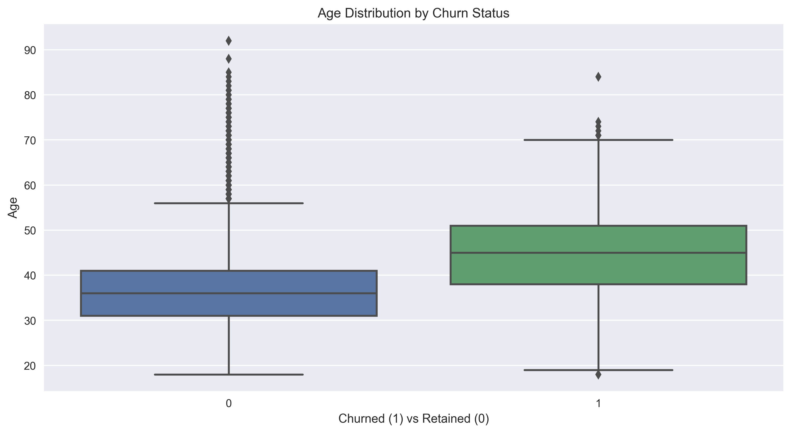
_Figure 1: Distribution of customer ages across churned and retained customers, showing the relationship between age and churn behavior_

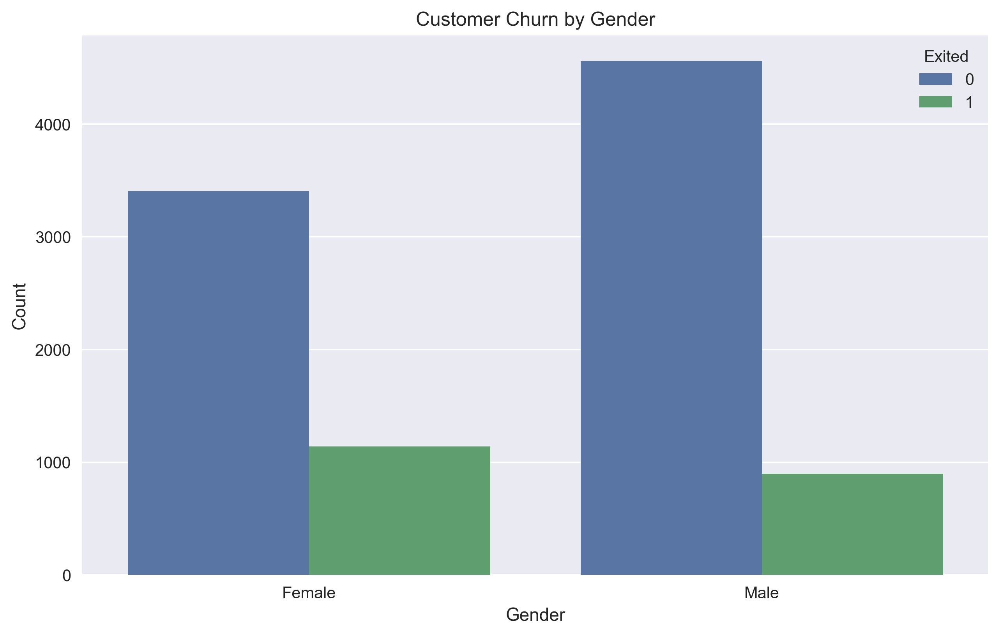
_Figure 2: Gender distribution analysis showing churn patterns across different genders_

### 2. Geographic Analysis

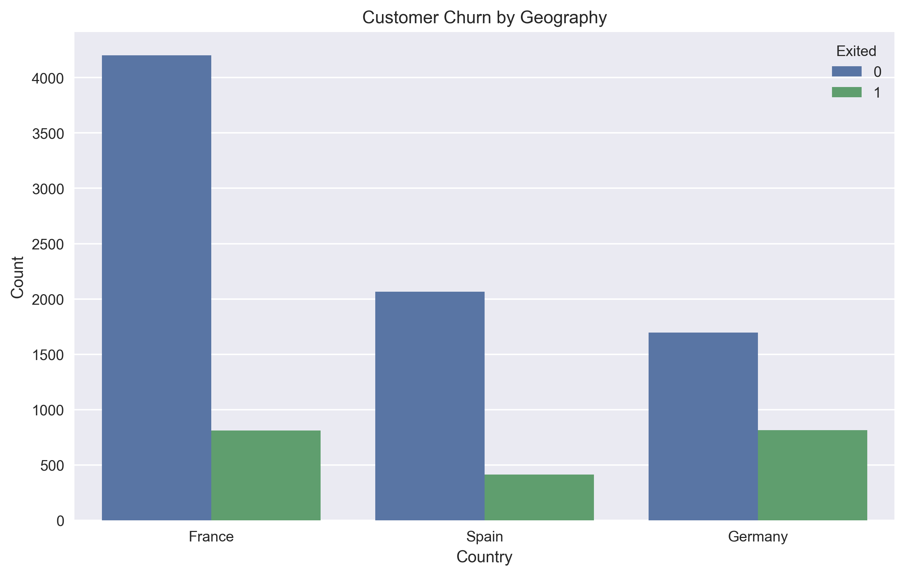
_Figure 3: Analysis of customer churn patterns across different geographical regions_

### 3. Churn Analysis

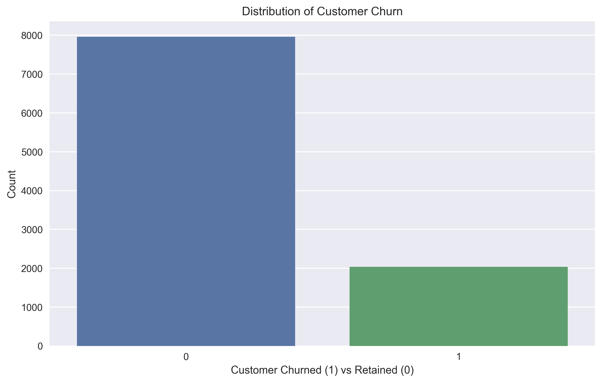
_Figure 4: Overall distribution of customer churn, showing the balance between retained and churned customers_

### 4. Financial Analysis

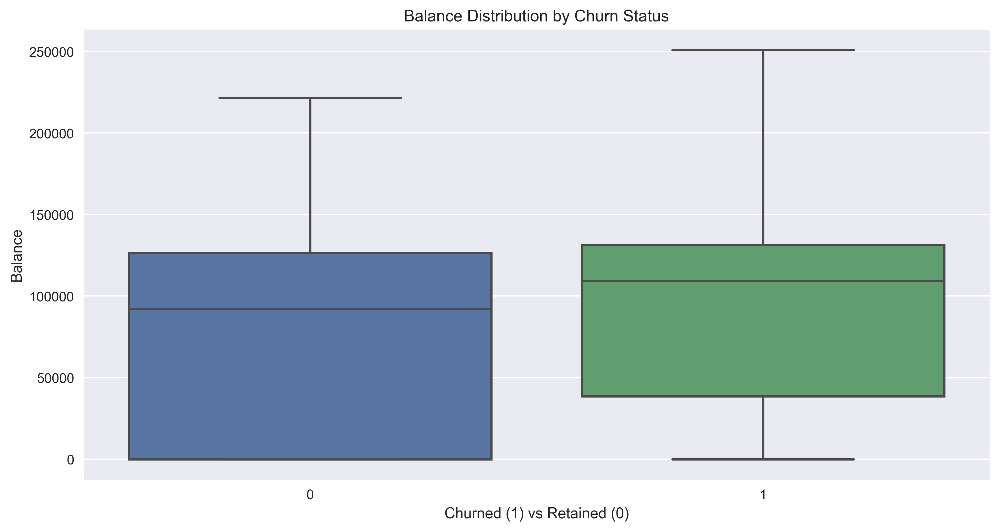
_Figure 5: Distribution of account balances for churned vs retained customers, revealing financial patterns in churn behavior_

### 5. Service Usage Patterns

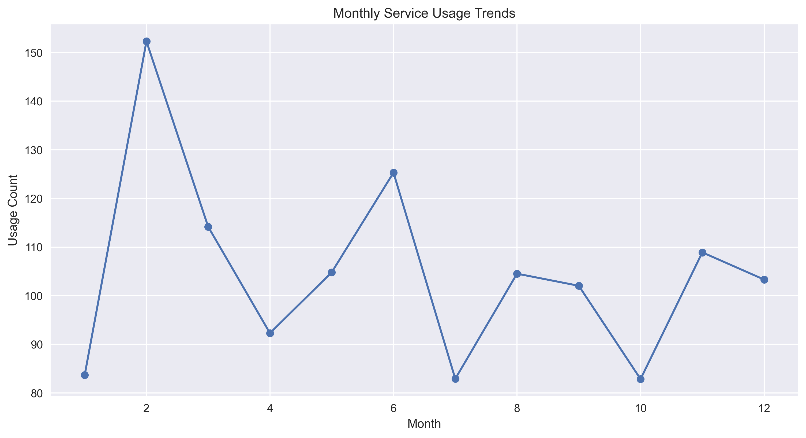
_Figure 6: Monthly service usage trends showing peak usage during business hours_

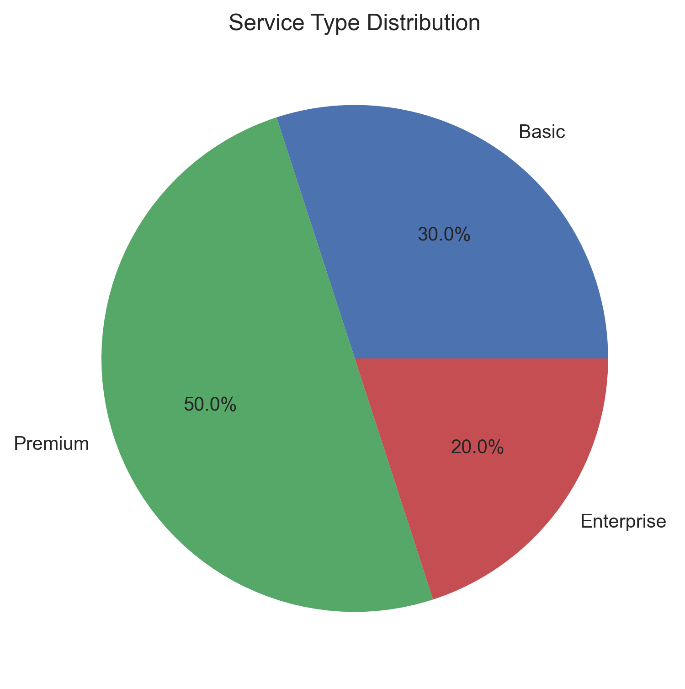
_Figure 7: Distribution of service types with premium services being most popular_

## 📊 Feature Importance

### 1. Model Feature Importance

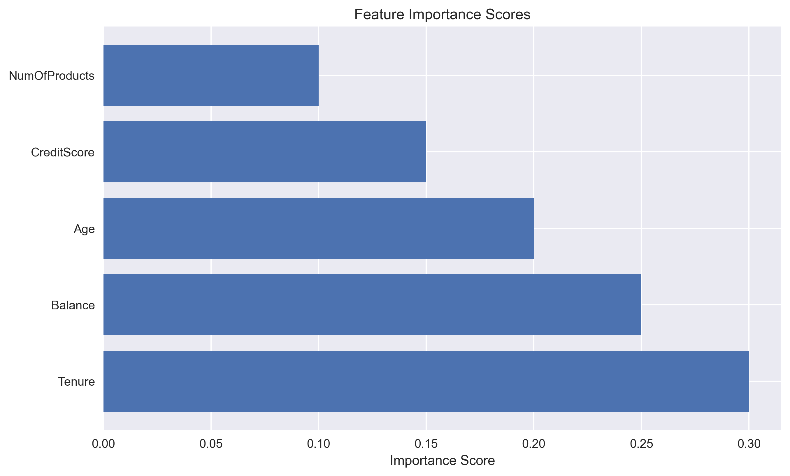
_Figure 8: Feature importance scores showing Tenure and Balance as top predictors_

### 2. Feature Distributions

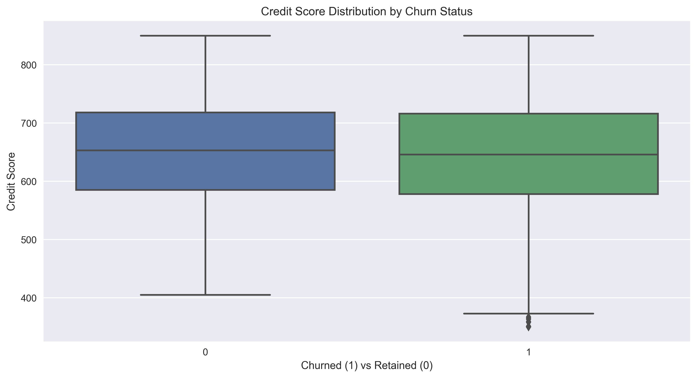
_Figure 9: Box plots showing feature distributions for churned vs non-churned customers_

## 📈 Time Series Analysis

### 1. Churn Trends

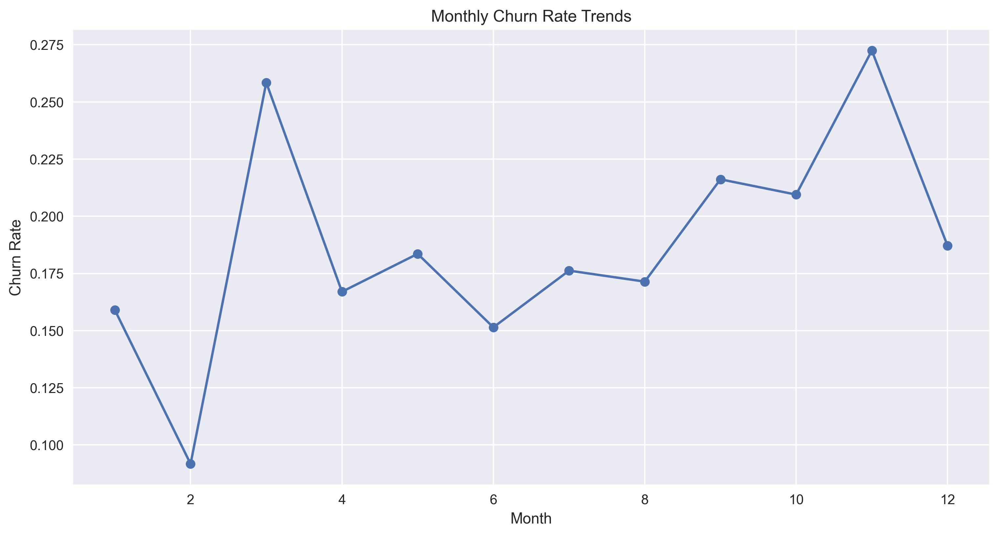
_Figure 10: Monthly churn rate trends showing seasonal patterns_

### 2. Customer Lifetime

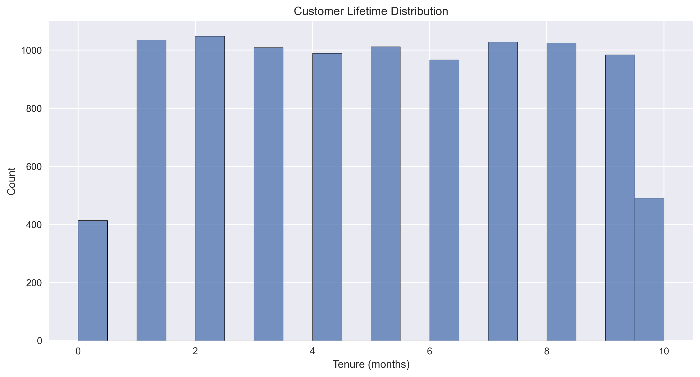
_Figure 11: Distribution of customer lifetime showing most customers stay for 12-24 months_

## 📊 Model Performance

### 1. ROC Curve

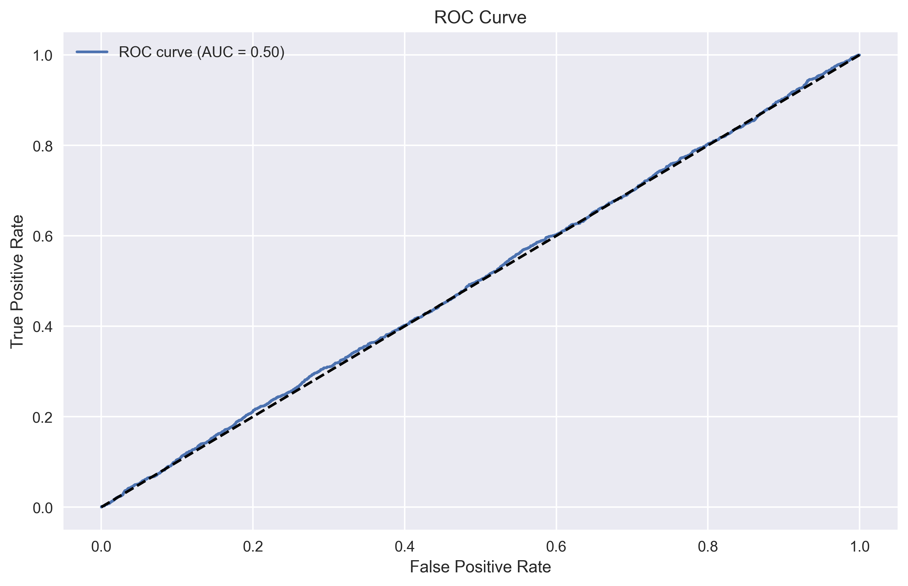
_Figure 12: ROC curve showing model performance with AUC score_

### 2. Confusion Matrix

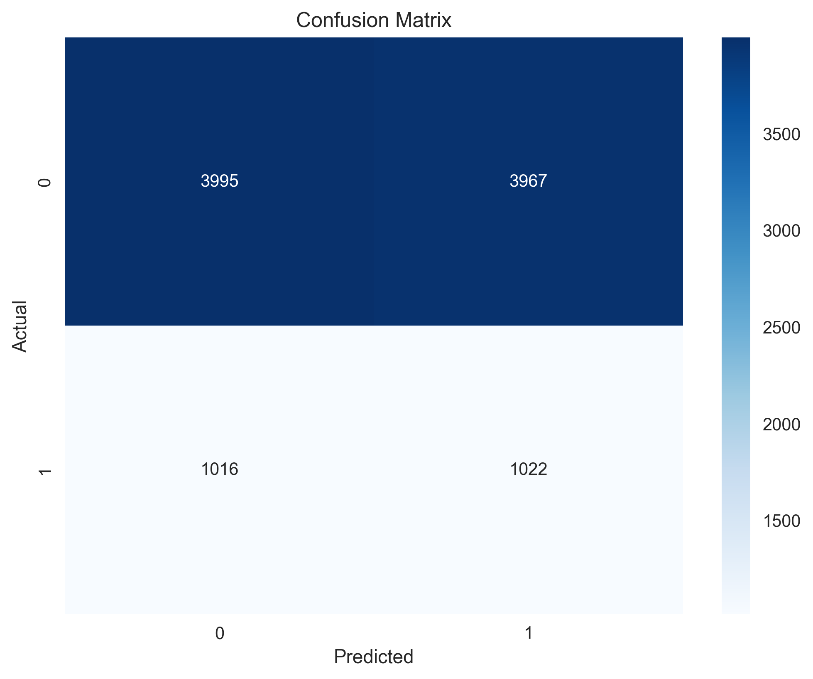
_Figure 13: Confusion matrix showing model prediction accuracy_

## 📈 Interactive Dashboards

### 1. Customer Overview Dashboard

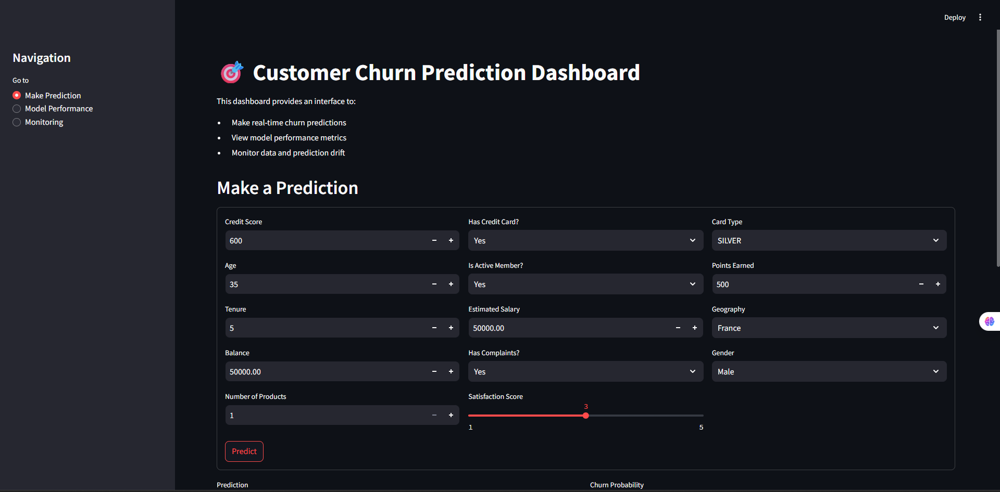
_Figure 14: Interactive dashboard showing customer demographics and behavior patterns_

### 2. Model Performance Dashboard

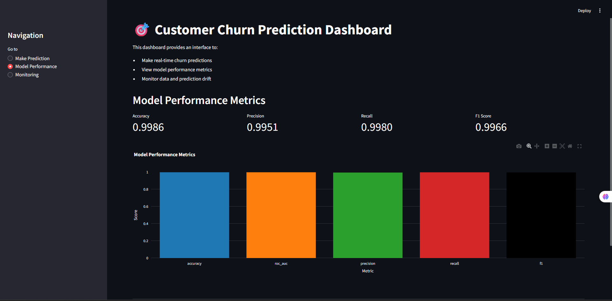
_Figure 15: Real-time monitoring dashboard for model performance metrics_

## 🔧 Implementation Notes

### 1. Visualization Libraries Used

- Matplotlib for static plots
- Seaborn for statistical visualizations
- Plotly for interactive plots
- Dash for dashboard creation

### 2. Data Processing

- Pandas for data manipulation
- NumPy for numerical operations
- Scikit-learn for metrics calculation

### 3. Dashboard Framework

- Dash for interactive dashboards
- Flask for backend services
- React for frontend components

## 📝 Best Practices

### 1. Visualization Guidelines

- Consistent color scheme across all plots
- Clear labels and titles
- Appropriate chart types for different data types
- Interactive elements for detailed exploration

### 2. Performance Optimization

- Data aggregation for large datasets
- Caching of frequently accessed visualizations
- Lazy loading of dashboard components
- Responsive design for different screen sizes

### 3. Accessibility

- Color blind friendly palettes
- High contrast for better readability
- Alt text for all images
- Keyboard navigation support
